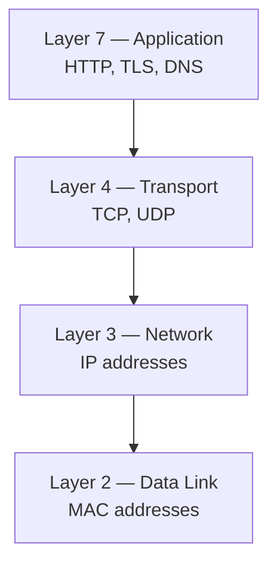
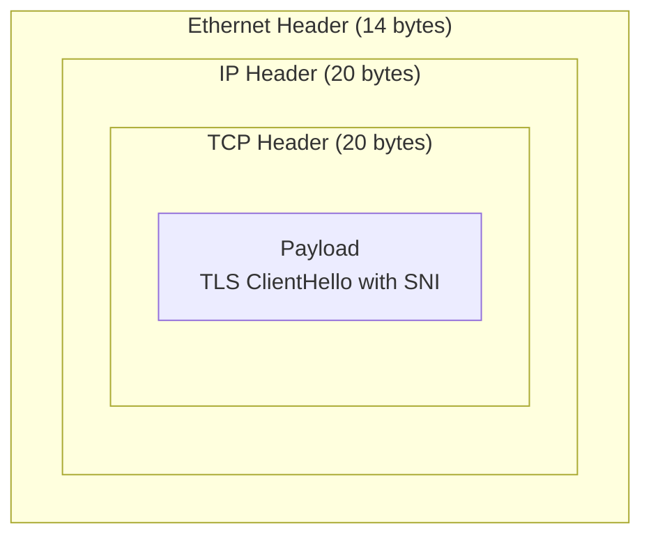
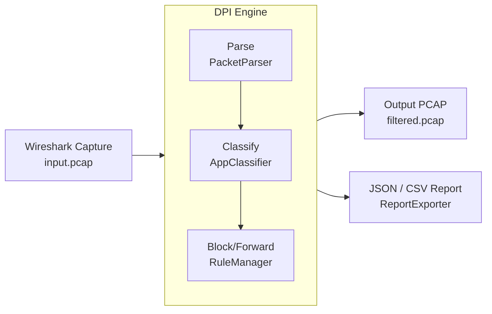
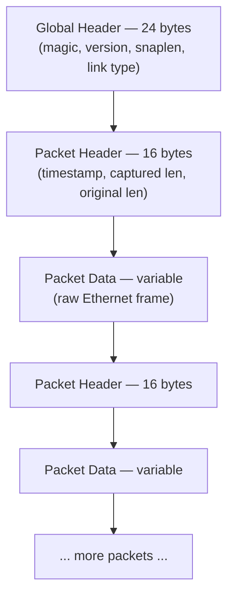
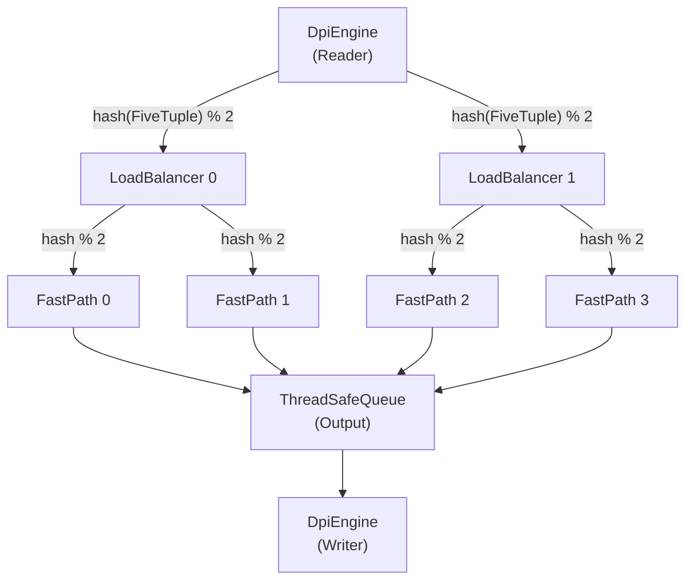
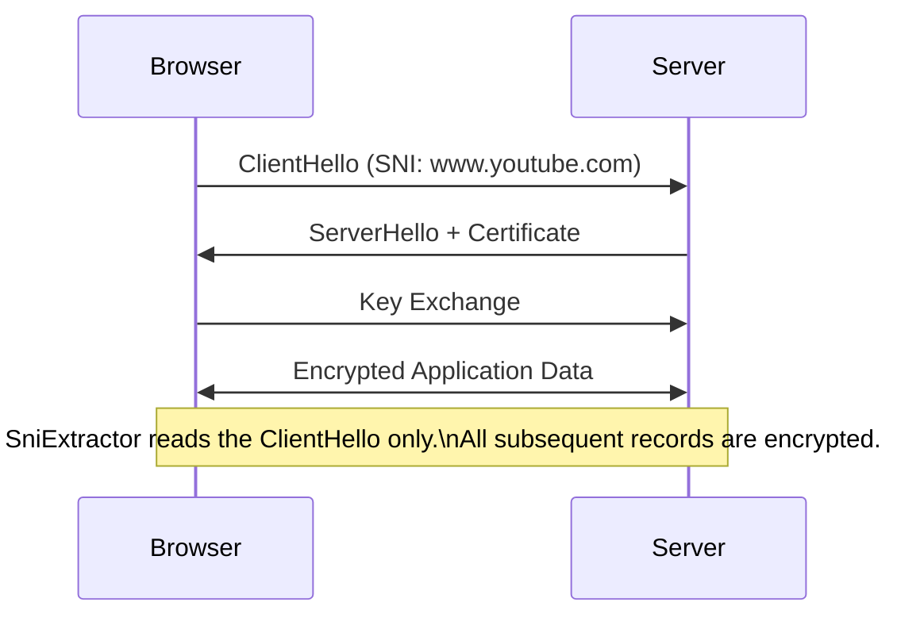
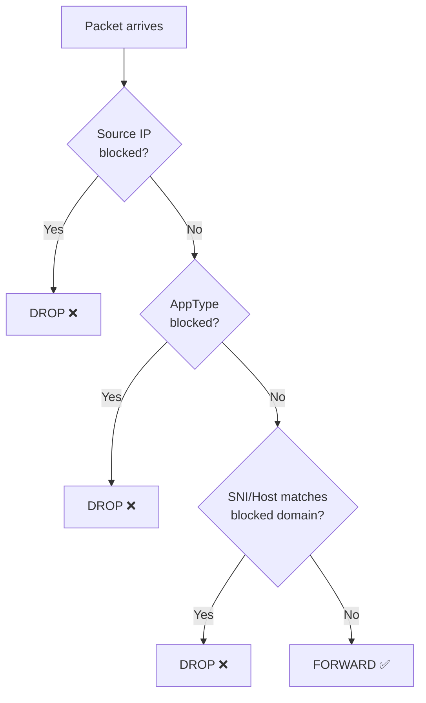
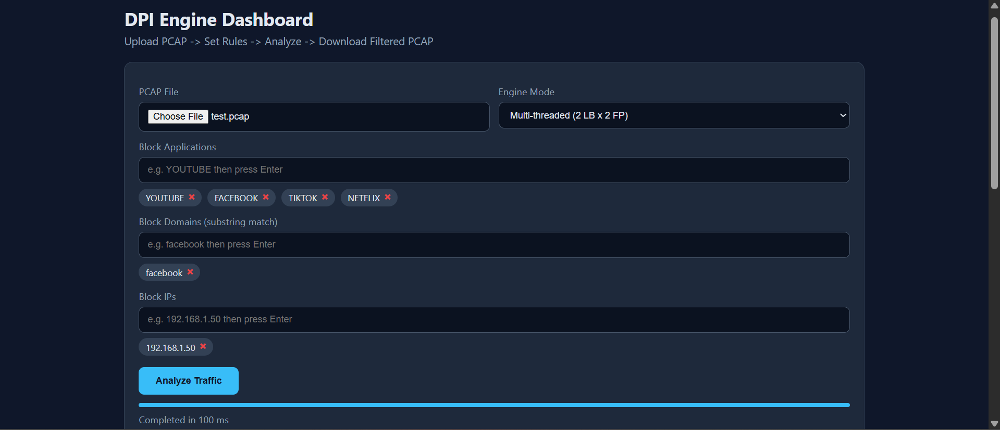
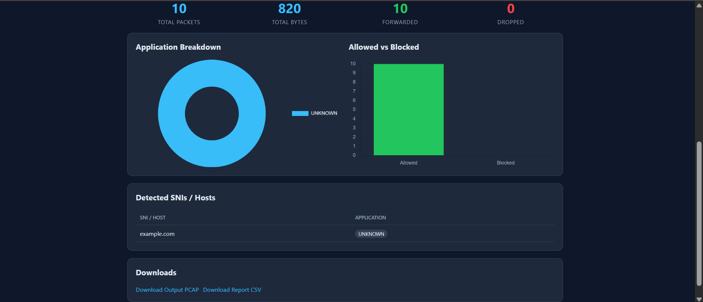

# DPI Engine

> A production-grade **Deep Packet Inspection (DPI)** engine written in Java that parses PCAP files, extracts TLS SNI and HTTP Host headers, classifies traffic by application, applies blocking rules, and generates structured reports.

[](https://www.oracle.com/java/)
[](https://maven.apache.org/)
[](https://spring.io/projects/spring-boot)

**Two execution modes:**

| Mode | Description |
|---|---|
| **CLI** | Offline PCAP file analysis with JSON/CSV report export |
| **Server** | Spring Boot REST API with a browser-based Web Dashboard |

---

## Table of Contents

1. [What Is DPI?](#what-is-dpi)
2. [Features](#features)
3. [How It Works](#how-it-works)
4. [Visual Diagrams](#visual-diagrams)
5. [Architecture](#architecture)
6. [Project Structure](#project-structure)
7. [Prerequisites](#prerequisites)
8. [Build](#build)
9. [CLI Usage](#cli-usage)
10. [REST API](#rest-api)
11. [Web Dashboard](#web-dashboard)
12. [Report Format](#report-format)
13. [Test Data Generation](#test-data-generation)
14. [Key Design Decisions](#key-design-decisions)
15. [Roadmap](#roadmap)

---

## What Is DPI?

**Deep Packet Inspection (DPI)** is a network analysis technique that examines packet contents beyond just headers. While a basic firewall only looks at source/destination IPs and ports, a DPI engine inspects the actual payload of each packet to identify applications, extract identifiers like TLS SNI or HTTP Host, and make intelligent forwarding or blocking decisions.

This engine operates on **PCAP files** — the standard capture format used by tools like Wireshark and `tcpdump` — and can identify traffic as YouTube, Netflix, TikTok, GitHub, and more, even when flows run on non-standard ports.

---

## Features

| Feature | Status | Notes |
|---|---|---|
| PCAP read/write (little-endian) | ✅ | Full global header + per-packet record support |
| Ethernet → IPv4 → TCP/UDP parsing | ✅ | Handled by `PacketParser` |
| TLS SNI extraction (ClientHello) | ✅ | `SniExtractor` reads the unencrypted extension |
| HTTP Host header extraction | ✅ | `HttpHostExtractor` scans plaintext payloads |
| Application classification | ✅ | `AppClassifier` maps SNI/Host to `AppType` enum |
| Blocking rules by IP | ✅ | Drop all packets from/to a given IPv4 address |
| Blocking rules by App | ✅ | Drop all packets for a given `AppType` |
| Blocking rules by Domain | ✅ | Drop when SNI/Host contains a substring |
| Single-threaded engine (`DpiSimple`) | ✅ | Simple and easy to debug |
| Multi-threaded pipeline (`DpiEngine`) | ✅ | Scales across CPU cores |
| JSON report export | ✅ | Via `ReportExporter` |
| CSV report export | ✅ | Via `ReportExporter` |
| Spring Boot REST API | ✅ | Async jobs via `DpiController` + `AnalysisService` |
| Web Dashboard | ✅ | Upload, analyze, visualize, and download |

---

## How It Works

The engine processes each packet through four stages:

### Stage 1 — Parse

A raw PCAP file is read by `PcapReader`. Each record is handed to `PacketParser`, which unwraps the network stack:

```
Ethernet Header (14 bytes)
  └── IPv4 Header (20 bytes)
        └── TCP/UDP Header (20 bytes)
              └── Payload (variable)
```

The result is a `ParsedPacket` containing all fields extracted from the `RawPacket`, including the 5-tuple stored in `FiveTuple` (`src_ip`, `dst_ip`, `src_port`, `dst_port`, `proto`).

### Stage 2 — Inspect

The payload is examined by two inspectors:

- **`SniExtractor`**: Parses the TLS record layer, the ClientHello handshake message, and the extension list to find the `server_name` extension (type `0x0000`), yielding the SNI hostname (e.g., `www.youtube.com`). Only the ClientHello is readable — all subsequent TLS records are encrypted.
- **`HttpHostExtractor`**: Scans plaintext payloads for the `Host:` header line in HTTP/1.1 traffic.

### Stage 3 — Classify

`AppClassifier` matches the extracted SNI or Host against a keyword map and assigns an `AppType`:

| Keyword Match | AppType |
|---|---|
| `youtube.com` | `YOUTUBE` |
| `facebook.com` / `fbcdn.net` | `FACEBOOK` |
| `tiktok.com` / `tiktokcdn.com` | `TIKTOK` |
| `twitter.com` / `x.com` | `TWITTER` |
| `netflix.com` | `NETFLIX` |
| `github.com` | `GITHUB` |
| `amazon.com` / `amazonaws.com` | `AMAZON` |
| `google.com` / `googleapis.com` | `GOOGLE` |
| TLS traffic, no SNI match | `HTTPS` |
| Plaintext, no Host match | `HTTP` |
| UDP port 53 | `DNS` |
| Everything else | `UNKNOWN` |

### Stage 4 — Block or Forward

`RuleManager` evaluates each classified packet against the active rule set in order:

1. Is the source IP in the blocked IP list? → **DROP**
2. Is the `AppType` in the blocked app list? → **DROP**
3. Does the SNI/Host contain a blocked domain substring? → **DROP**
4. No match → **FORWARD**

Forwarded packets are written to the output PCAP by `PcapWriter`. Dropped packets are counted in `TrafficReport`.

---

## Visual Diagrams

### 1. Network Stack Layers



### 2. Packet Structure (Russian Nesting Doll)



### 3. DPI Engine Flow



### 4. PCAP File Format



PCAP global/packet headers use **little-endian**. Network protocol headers (IP, TCP) use **big-endian**. `PcapReader` handles both.

### 5. Multi-threaded Architecture



Each flow (`FiveTuple`) is consistently hashed to the same `FastPath` — no shared flow state between threads. The output queue is backed by `ThreadSafeQueue`. Reader and Writer logic live inline inside `DpiEngine`.

### 6. TLS Handshake and SNI Extraction



### 7. Blocking Decision Flow



---

## Architecture

### Single-threaded: `DpiSimple`

Processes packets sequentially in a single loop. Best for small files and debugging.

```
PcapReader
  → PacketParser  (RawPacket → ParsedPacket)
    → SniExtractor / HttpHostExtractor
      → AppClassifier  (→ AppType)
        → RuleManager  (FORWARD / DROP)
          → PcapWriter
            → ReportBuilder → TrafficReport → ReportExporter
```

### Multi-threaded: `DpiEngine`

A pipeline of concurrent threads connected by `ThreadSafeQueue` instances.

```
DpiEngine (Reader)
  → hash(FiveTuple) % numLBs  →  LoadBalancer[0..N]
                                    → hash(FiveTuple) % numFPs  →  FastPath[0..M]
                                                                       → ThreadSafeQueue (output)
                                                                           → DpiEngine (Writer)
```

| Component | Class | Role |
|---|---|---|
| Reader | `DpiEngine` (inline) | Reads raw PCAP packets, distributes by `FiveTuple` hash |
| Load Balancer | `LoadBalancer` | Second-level router to `FastPath` threads |
| Fast Path | `FastPath` | Parses, inspects, classifies, applies `RuleManager` |
| Connection Tracker | `ConnectionTracker` | Tracks per-flow state within a `FastPath` |
| Output Queue | `ThreadSafeQueue` | Thread-safe handoff from `FastPath` to writer |
| Writer | `DpiEngine` (inline) | Drains `ThreadSafeQueue`, writes filtered PCAP |
| Report | `ReportBuilder` → `ReportExporter` | Aggregates stats into `TrafficReport`, exports JSON/CSV |

---

## Project Structure

```
dpi-engine/
├── pom.xml
└── src/
    └── main/
        ├── java/dpi/
        │   ├── model/
        │   │   ├── AppType.java          # Enum: YOUTUBE, FACEBOOK, NETFLIX, TIKTOK, etc.
        │   │   ├── FiveTuple.java        # Flow key: src/dst IP, src/dst port, protocol
        │   │   ├── Flow.java             # Per-flow state tracked by ConnectionTracker
        │   │   ├── RawPacket.java        # Raw bytes + PCAP metadata from PcapReader
        │   │   ├── ParsedPacket.java     # Fully decoded packet with all header fields
        │   │   └── TrafficReport.java    # Structured analysis result (stats, SNIs, breakdown)
        │   │
        │   ├── io/
        │   │   ├── PcapReader.java       # Reads PCAP global header + packet records
        │   │   └── PcapWriter.java       # Writes filtered packets to output PCAP
        │   │
        │   ├── parser/
        │   │   └── PacketParser.java     # Ethernet / IP / TCP / UDP parsing (RawPacket → ParsedPacket)
        │   │
        │   ├── inspector/
        │   │   ├── SniExtractor.java     # Parses TLS ClientHello, extracts SNI hostname
        │   │   └── HttpHostExtractor.java# Extracts Host header from HTTP/1.1 payloads
        │   │
        │   ├── engine/
        │   │   ├── AppClassifier.java    # Maps SNI/Host keyword to AppType
        │   │   ├── ConnectionTracker.java# Tracks active flows within a FastPath thread
        │   │   ├── FastPath.java         # Per-flow parse → inspect → classify → rule check
        │   │   ├── LoadBalancer.java     # Routes packets by FiveTuple hash to FastPath threads
        │   │   ├── ReportBuilder.java    # Aggregates per-packet decisions into TrafficReport
        │   │   ├── ReportExporter.java   # Writes TrafficReport to JSON and/or CSV
        │   │   ├── RuleManager.java      # Evaluates IP / AppType / domain rules → FORWARD or DROP
        │   │   └── ThreadSafeQueue.java  # Blocking queue connecting pipeline stages
        │   │
        │   ├── api/
        │   │   ├── AnalysisJob.java      # Job entity: ID, status, report path, output PCAP path
        │   │   ├── AnalysisService.java  # Async executor: runs DpiEngine for a submitted job
        │   │   └── DpiController.java    # REST endpoints: submit, poll, download report/PCAP
        │   │
        │   ├── DpiSimple.java            # Single-threaded CLI entry point
        │   ├── DpiEngine.java            # Multi-threaded CLI entry point (reader + writer inline)
        │   ├── DpiLauncher.java          # Parses CLI args, selects DpiSimple or DpiEngine
        │   ├── DpiApiApplication.java    # Spring Boot main class
        │   └── PcapGenerator.java        # Generates synthetic test PCAP files
        │
        └── resources/
            ├── application.properties    # Spring Boot config (port, upload size limits)
            └── static/
                └── index.html            # Single-page Web Dashboard
```

---

## Prerequisites

| Requirement | Minimum Version | Check Command |
|---|---|---|
| Java JDK | 17 | `java -version` |
| Apache Maven | 3.8 | `mvn -version` |

---

## Build

```bash
mvn clean package
```

Output:

```
target/dpi-engine.jar
```

The JAR is fully self-contained — includes Spring Boot, Jackson, and all dependencies.

---

## CLI Usage

`DpiLauncher` auto-detects CLI mode when the first two arguments end in `.pcap`.

### Minimal Analysis

```bash
java -jar target/dpi-engine.jar input.pcap output.pcap --simple
```

### With Blocking Rules

```bash
java -jar target/dpi-engine.jar input.pcap output.pcap --simple \
  --block-app YOUTUBE \
  --block-domain facebook \
  --block-ip 192.168.1.50
```

### With Report Export

```bash
java -jar target/dpi-engine.jar input.pcap output.pcap --simple \
  --block-app YOUTUBE \
  --report-json report.json \
  --report-csv report.csv
```

### Multi-threaded Engine

```bash
java -jar target/dpi-engine.jar input.pcap output.pcap \
  --lbs 2 --fps 2 \
  --block-app TIKTOK \
  --report-json report.json
```

### CLI Flag Reference

| Flag | Description |
|---|---|
| `--simple` | Use single-threaded `DpiSimple` engine |
| `--lbs N` | Number of `LoadBalancer` threads |
| `--fps N` | Number of `FastPath` threads per load balancer |
| `--block-app APP` | Block by `AppType` (e.g. `YOUTUBE`, `NETFLIX`, `TIKTOK`) |
| `--block-ip IP` | Block all packets from/to an IPv4 address |
| `--block-domain STR` | Block when SNI or Host contains this substring |
| `--report-json PATH` | Write JSON report via `ReportExporter` |
| `--report-csv PATH` | Write CSV report via `ReportExporter` |

Multiple `--block-*` flags can be combined in a single command.

---

## REST API

### Start the Server

```bash
mvn spring-boot:run
```

Server listens at `http://localhost:8080`.

### Endpoints

| Method | Path | Handler | Description |
|---|---|---|---|
| `POST` | `/api/analyze` | `DpiController` | Upload PCAP + rules; returns job ID |
| `GET` | `/api/jobs/{id}` | `DpiController` | Poll job status |
| `GET` | `/api/jobs/{id}/report` | `DpiController` | Get JSON report for a completed job |
| `GET` | `/api/jobs/{id}/output` | `DpiController` | Download filtered output PCAP |
| `GET` | `/api/jobs/{id}/report.csv` | `DpiController` | Download CSV report |

`AnalysisService` runs the DPI job in a background thread pool and writes the result back to the `AnalysisJob` entity when complete.

### POST `/api/analyze` — Form Parameters

| Field | Type | Description |
|---|---|---|
| `pcap` | file | The `.pcap` file to analyze |
| `simple` | boolean | Use `DpiSimple` (single-threaded) |
| `lbs` | integer | Number of `LoadBalancer` threads |
| `fps` | integer | Number of `FastPath` threads per LB |
| `blockApp` | string | `AppType` to block (repeatable) |
| `blockDomain` | string | Domain substring to block (repeatable) |
| `blockIp` | string | IPv4 address to block (repeatable) |

### cURL Workflow

```bash
# 1. Submit analysis
curl -X POST http://localhost:8080/api/analyze \
  -F "pcap=@test.pcap" \
  -F "blockApp=YOUTUBE" \
  -F "blockDomain=facebook" \
  -F "blockIp=192.168.1.50" \
  -F "simple=false" \
  -F "lbs=2" \
  -F "fps=2"
# → { "jobId": "abc123", "status": "PENDING" }

# 2. Poll status
curl http://localhost:8080/api/jobs/abc123
# → { "jobId": "abc123", "status": "DONE" }

# 3. Get JSON report
curl http://localhost:8080/api/jobs/abc123/report

# 4. Download filtered PCAP
curl -O http://localhost:8080/api/jobs/abc123/output

# 5. Download CSV report
curl -O http://localhost:8080/api/jobs/abc123/report.csv
```

---

## Web Dashboard

Open `http://localhost:8080` after starting the server.

### Workflow

1. **Upload** — Select a `.pcap` file.
2. **Configure** — Choose `Simple` or `Multi-threaded`; set LB and FP counts.
3. **Add Rules** — Tag `App`, `Domain`, or `IP` values to block.
4. **Analyze** — Click `Analyze Traffic`. `AnalysisService` runs the job asynchronously.
5. **Review** — Bar charts show `AppType` breakdown; tables list detected SNIs.
6. **Download** — Save the filtered PCAP and CSV report.

### Screenshots

#### Web Dashboard


#### Working and Visualization


---

## Report Format

### JSON (`TrafficReport`)

```json
{
  "totalPackets": 77,
  "totalBytes": 5738,
  "tcpPackets": 73,
  "udpPackets": 4,
  "forwarded": 69,
  "dropped": 8,
  "processingTimeMs": 45,
  "appBreakdown": [
    {
      "appType": "HTTPS",
      "count": 39,
      "percentage": 50.6,
      "blocked": false,
      "bar": "##########"
    },
    {
      "appType": "YOUTUBE",
      "count": 8,
      "percentage": 10.4,
      "blocked": true,
      "bar": "##"
    }
  ],
  "detectedSnis": [
    { "sni": "www.youtube.com",      "appType": "YOUTUBE"  },
    { "sni": "static.xx.fbcdn.net",  "appType": "FACEBOOK" }
  ]
}
```

### CSV (`ReportExporter`)

```csv
Metric,Value
Total Packets,77
Total Bytes,5738
TCP Packets,73
UDP Packets,4
Forwarded,69
Dropped,8
Processing Time (ms),45

Application,Count,Percentage,Blocked
HTTPS,39,50.6,false
YOUTUBE,8,10.4,true

SNI,Application
www.youtube.com,YOUTUBE
static.xx.fbcdn.net,FACEBOOK
```

---

## Test Data Generation

```bash
java -cp target/classes dpi.PcapGenerator test.pcap
```

`PcapGenerator` produces a synthetic PCAP containing:

| Traffic Type | Details |
|---|---|
| TLS ClientHello with SNI | `www.youtube.com`, `www.facebook.com`, `www.tiktok.com`, `github.com` |
| HTTP/1.1 with Host header | `www.example.com` |
| DNS query (UDP/53) | Random hostnames |
| Plain TCP | Random payloads |
| Mixed source IPs | Useful for testing IP-based blocking |

---

## Key Design Decisions

### `FiveTuple` for Flow Identity
Every packet's flow is identified by the 5-tuple `(src_ip, dst_ip, src_port, dst_port, proto)` encapsulated in `FiveTuple`. Consistent hashing of this object routes all packets from the same flow to the same `FastPath` thread — eliminating any need for locks on per-flow state.

### `ConnectionTracker` per `FastPath`
Each `FastPath` owns its own `ConnectionTracker`, which maintains state for flows currently assigned to it. Because flows never migrate between threads, the tracker needs no synchronization.

### `ThreadSafeQueue` for Pipeline Handoff
All inter-thread communication between `LoadBalancer`, `FastPath`, and the writer goes through `ThreadSafeQueue`. A poison-pill packet is enqueued after the last real packet; each stage passes it downstream before shutting down, ensuring clean ordered termination.

### Endianness
PCAP global and packet headers use **little-endian** (written by `tcpdump`/Wireshark on x86). IP and TCP headers use **big-endian** (network byte order). `PcapReader` and `PacketParser` both set `ByteBuffer` order explicitly.

### Async REST Jobs
`DpiController` returns a `jobId` immediately. `AnalysisService` executes the analysis in a thread pool and updates the `AnalysisJob` status when done. Clients poll until the status indicates completion.

---

## Roadmap

### Phase 1 — Core Engine ✅

- [x] PCAP I/O (`PcapReader`, `PcapWriter`)
- [x] Packet parsing (`PacketParser`, `RawPacket` → `ParsedPacket`)
- [x] TLS SNI extraction (`SniExtractor`)
- [x] HTTP Host extraction (`HttpHostExtractor`)
- [x] Application classification (`AppClassifier`)
- [x] Rule engine (`RuleManager`)
- [x] Single-threaded `DpiSimple`
- [x] Multi-threaded `DpiEngine` (`LoadBalancer`, `FastPath`, `ThreadSafeQueue`)

### Phase 2 — Reporting and API ✅

- [x] Structured reports (`ReportBuilder`, `TrafficReport`)
- [x] JSON and CSV export (`ReportExporter`)
- [x] Spring Boot REST API (`DpiController`, `AnalysisService`)
- [x] Web Dashboard (`index.html`)

### Phase 3 — Detection Improvements 🔜

- [ ] DNS response parsing (map query names to resolved IPs)
- [ ] TLS JA3 fingerprint extraction
- [ ] HTTP method, path, and response code statistics
- [ ] Direction-aware rules (inbound vs outbound)
- [ ] QUIC / HTTP3 detection (UDP/443)

### Phase 4 — Enterprise Features 🔜

- [ ] Time-based rules (e.g. block YOUTUBE 9am–5pm)
- [ ] Allowlist override (whitelist takes precedence over block rules)
- [ ] Rule priorities and configurable actions
- [ ] Persistent job storage
- [ ] Live interface capture mode (`pcap4j` integration)
- [ ] Prometheus metrics endpoint
