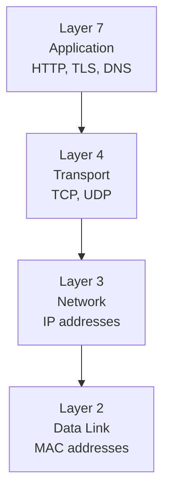
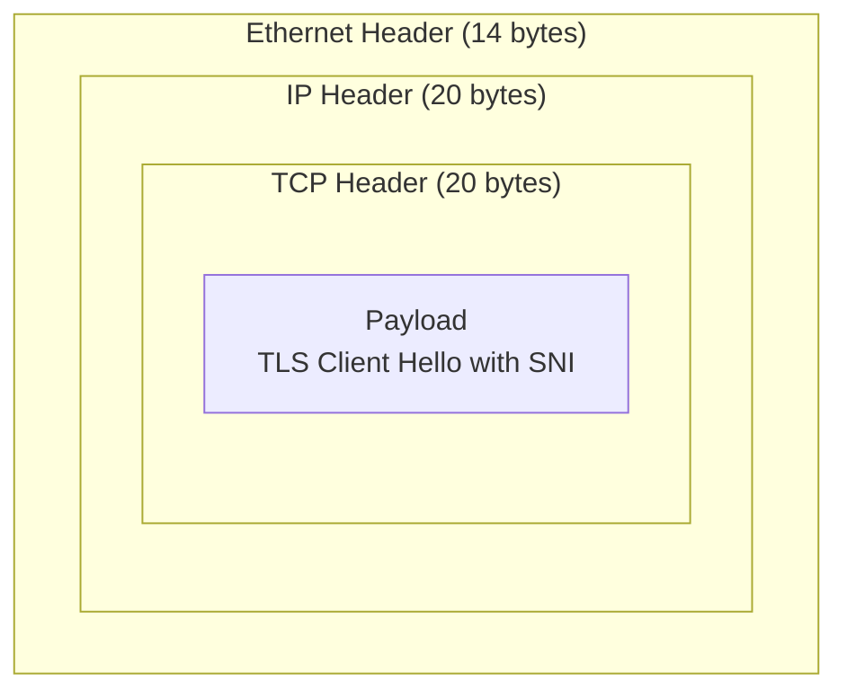
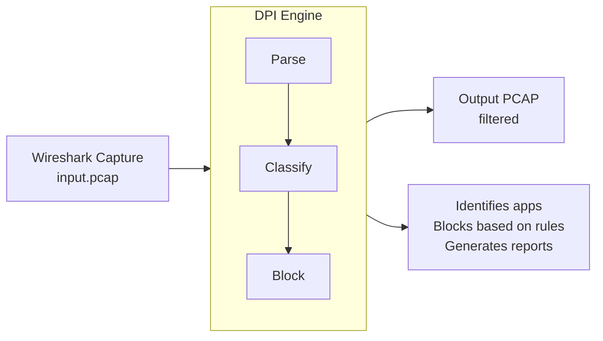
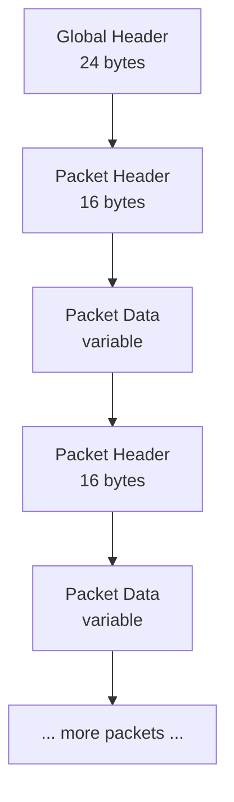
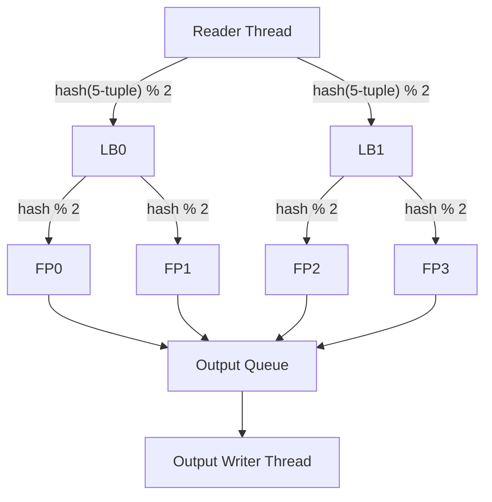
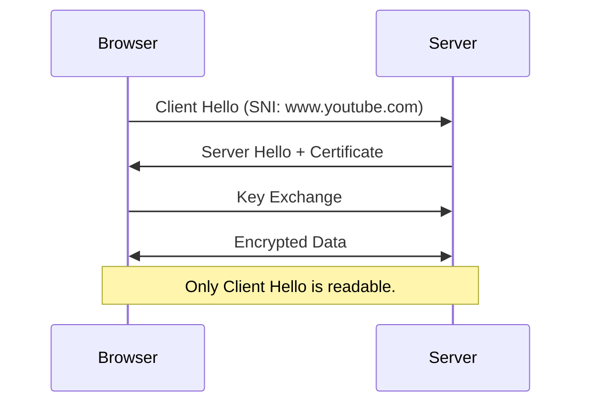
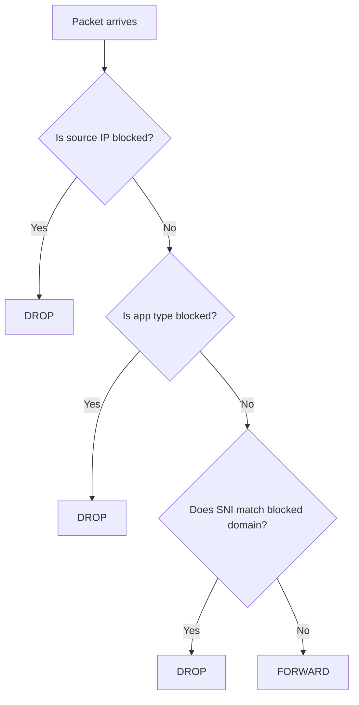
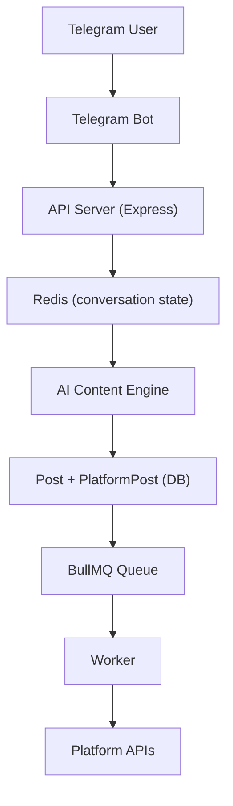

# DPI Engine (Java)

A production-grade Deep Packet Inspection engine written in Java that parses PCAP files, extracts TLS SNI and HTTP Host headers, classifies traffic by application, applies blocking rules, and generates structured reports.

Two execution modes:
- CLI: offline PCAP analysis with JSON/CSV export
- Server: Spring Boot REST API + Web Dashboard

---

## Table of Contents

1. [Features](#features)
2. [Visual Diagrams](#visual-diagrams)
3. [Architecture](#architecture)
4. [Project Structure](#project-structure)
5. [Prerequisites](#prerequisites)
6. [Build](#build)
7. [CLI Usage](#cli-usage)
8. [REST API](#rest-api)
9. [Web Dashboard](#web-dashboard)
10. [Report Format](#report-format)
11. [Test Data Generation](#test-data-generation)
12. [Roadmap](#roadmap)

---

## Features

| Feature | Status |
|---|---|
| PCAP read/write (little-endian) | Yes |
| Ethernet -> IPv4 -> TCP/UDP parsing | Yes |
| TLS SNI extraction (ClientHello) | Yes |
| HTTP Host extraction | Yes |
| Application classification | Yes |
| Blocking rules by IP, App, Domain | Yes |
| Single-threaded engine (`DpiSimple`) | Yes |
| Multi-threaded pipeline (`DpiEngine`) | Yes |
| JSON and CSV report export | Yes |
| Spring Boot REST API | Yes |
| Web Dashboard | Yes |

---

## Visual Diagrams

### 1) Network Stack Layers



### 2) Packet Structure (Russian Nesting Doll)



### 3) DPI Engine Flow (Project Overview)



### 4) PCAP File Format Structure



### 5) Multi-threaded Architecture



### 6) TLS Handshake Flow



### 7) Blocking Decision Flow



### 8) Data Flow Architecture (Full System)



---

## Architecture

### Single-threaded (`DpiSimple`)

```text
PCAP Reader -> Packet Parser -> SNI/Host Extractor -> Classifier -> Rule Manager -> Writer -> Report
```

### Multi-threaded (`DpiEngine`)

```text
ReaderThread
  -> hash(5-tuple) % numLBs
LoadBalancer threads
  -> hash(5-tuple) % numFPs
FastPath threads
  -> OutputQueue
WriterThread
```

Key design decisions:
- Consistent hashing keeps each flow on one FastPath thread.
- No shared flow map between workers.
- Poison-pill packets signal shutdown through queues.
- PCAP headers use little-endian; network protocol parsing uses big-endian.

---

## Project Structure

```text
src/main/java/dpi/
  model/
  io/
  parser/
  inspector/
  engine/
  api/
  DpiSimple.java
  DpiEngine.java
  DpiLauncher.java
  DpiApiApplication.java
  PcapGenerator.java

src/main/resources/
  application.properties
  static/index.html
```

---

## Prerequisites

- Java 17 or later
- Maven 3.8 or later

Verify:

```bash
java -version
mvn -version
```

---

## Build

```bash
mvn clean package
```

Output artifact:
- `target/dpi-engine.jar`

---

## CLI Usage

The launcher auto-detects CLI mode when the first two arguments end in `.pcap`.

### Basic analysis

```bash
java -jar target/dpi-engine.jar input.pcap output.pcap --simple
```

### With blocking rules

```bash
java -jar target/dpi-engine.jar input.pcap output.pcap --simple --block-app YOUTUBE --block-domain facebook --block-ip 192.168.1.50
```

### With report export

```bash
java -jar target/dpi-engine.jar input.pcap output.pcap --simple --block-app YOUTUBE --report-json report.json --report-csv report.csv
```

### Multi-threaded engine

```bash
java -jar target/dpi-engine.jar input.pcap output.pcap --lbs 2 --fps 2 --block-app TIKTOK
```

CLI options:

| Flag | Description |
|---|---|
| `--simple` | Use single-threaded engine |
| `--lbs N` | Number of load balancers |
| `--fps N` | FastPaths per load balancer |
| `--block-app APP` | Block by app type |
| `--block-ip IP` | Block by IPv4 address |
| `--block-domain STR` | Block when SNI/Host contains substring |
| `--report-json PATH` | Export report to JSON |
| `--report-csv PATH` | Export report to CSV |

---

## REST API

Start the server:

```bash
mvn spring-boot:run
```

Base URL: `http://localhost:8080`

### Endpoints

| Method | Path | Description |
|---|---|---|
| `POST` | `/api/analyze` | Upload PCAP + rules, returns job ID |
| `GET` | `/api/jobs/{id}` | Poll job status |
| `GET` | `/api/jobs/{id}/report` | Get JSON report |
| `GET` | `/api/jobs/{id}/output` | Download filtered PCAP |
| `GET` | `/api/jobs/{id}/report.csv` | Download CSV report |

### Example cURL workflow

```bash
# 1) Submit analysis
curl -X POST http://localhost:8080/api/analyze \
  -F "pcap=@test.pcap" \
  -F "blockApp=YOUTUBE" \
  -F "blockDomain=facebook" \
  -F "blockIp=192.168.1.50" \
  -F "simple=false" \
  -F "lbs=2" \
  -F "fps=2"

# 2) Poll status
curl http://localhost:8080/api/jobs/<job-id>

# 3) Get JSON report
curl http://localhost:8080/api/jobs/<job-id>/report
```

---

## Web Dashboard

Open `http://localhost:8080` after starting the server.

Workflow:
1. Upload a `.pcap` file.
2. Select engine mode (`Simple` or `Multi-threaded`).
3. Add rule tags (`App`, `Domain`, `IP`).
4. Click `Analyze Traffic`.
5. Review charts/tables.
6. Download output PCAP and CSV report.

---

## Report Format

### JSON Structure

```json
{
  "totalPackets": 77,
  "totalBytes": 5738,
  "tcpPackets": 73,
  "udpPackets": 4,
  "forwarded": 69,
  "dropped": 8,
  "processingTimeMs": 45,
  "appBreakdown": [
    {
      "appType": "HTTPS",
      "count": 39,
      "percentage": 50.6,
      "blocked": false,
      "bar": "##########"
    }
  ],
  "detectedSnis": [
    {
      "sni": "www.youtube.com",
      "appType": "YouTube"
    }
  ]
}
```

### CSV Structure

```csv
Metric,Value
Total Packets,77
Total Bytes,5738

Application,Count,Percentage,Blocked
HTTPS,39,50.6,false

SNI,Application
www.youtube.com,YouTube
```

---

## Test Data Generation

Generate sample traffic:

```bash
java -cp target/classes dpi.PcapGenerator test.pcap
```

Includes sample TLS, HTTP, DNS, and random TCP packets.

---

## Roadmap

### Phase 1 - Core Engine
- [x] PCAP I/O
- [x] Ethernet/IPv4/TCP/UDP parsing
- [x] TLS SNI extraction
- [x] HTTP Host extraction
- [x] Rule engine

### Phase 2 - Reporting and API
- [x] JSON/CSV reports
- [x] Spring Boot API
- [x] Async job flow
- [x] Web dashboard

### Phase 3 - Detection Improvements
- [ ] DNS request/response parsing
- [ ] TLS JA3 hooks
- [ ] HTTP method/path statistics
- [ ] Direction-aware rules

### Phase 4 - Enterprise Features
- [ ] Time-based rules
- [ ] Allowlist override
- [ ] Rule priorities and actions
- [ ] Persistence and historical search
- [ ] Live interface capture mode

---
