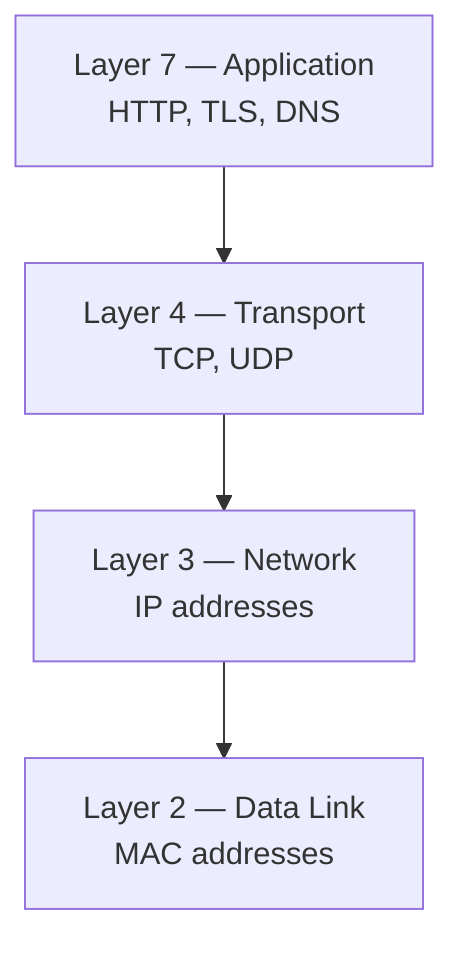
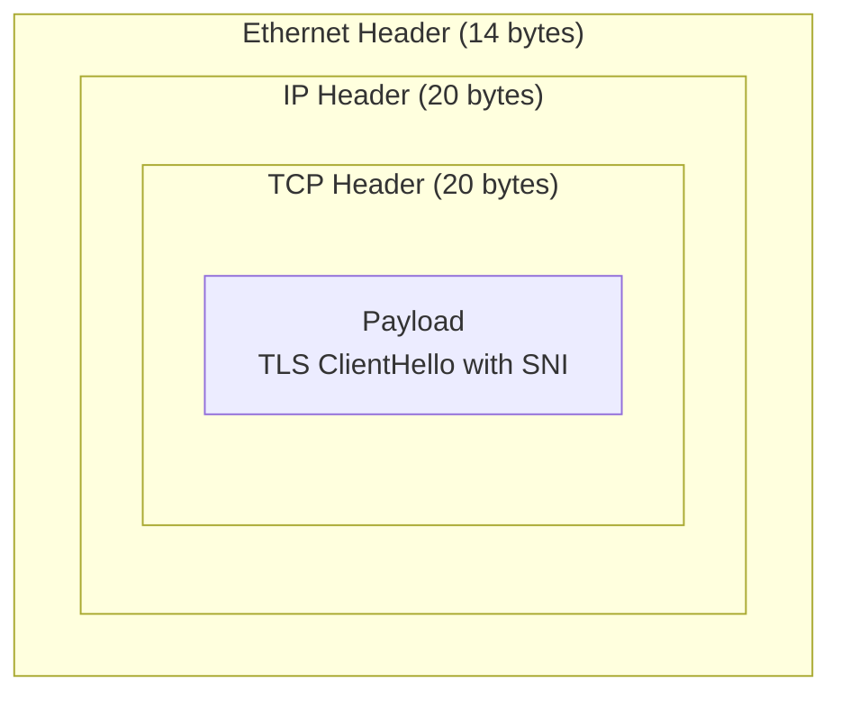
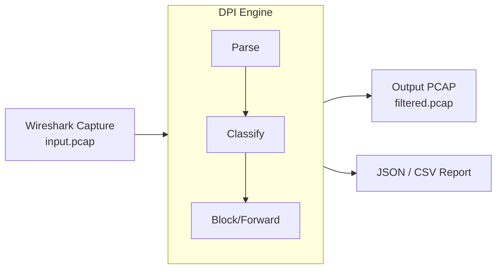
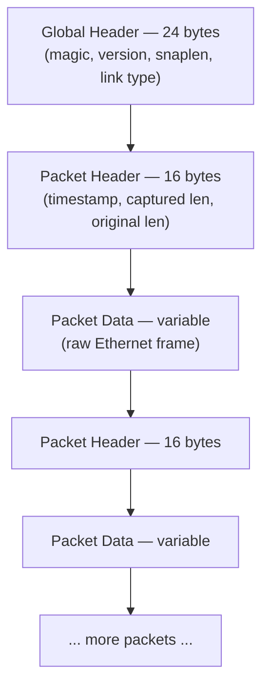
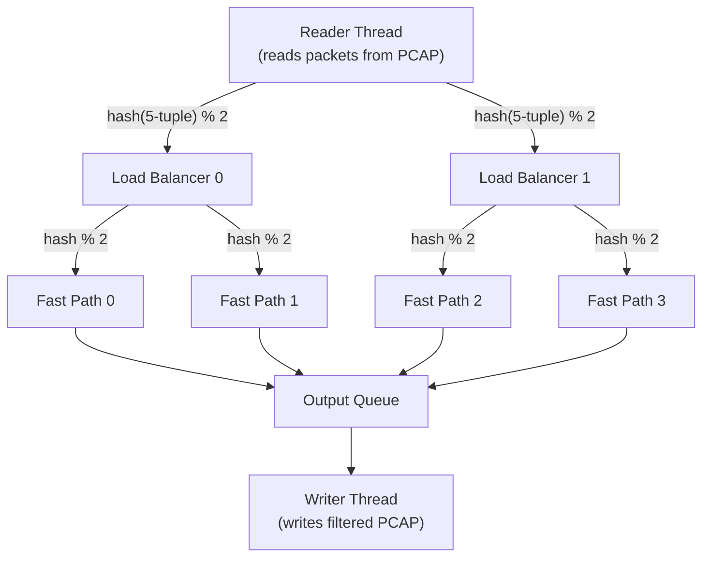
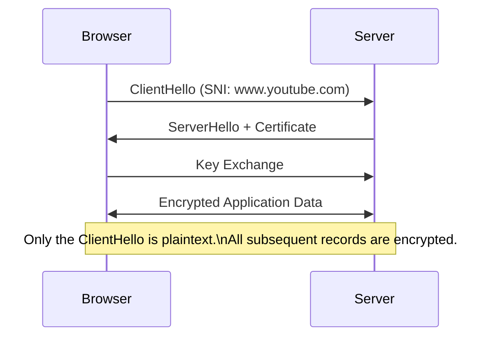

# DPI Engine

> A production-grade **Deep Packet Inspection (DPI)** engine written in Java that parses PCAP files, extracts TLS SNI and HTTP Host headers, classifies traffic by application, applies blocking rules, and generates structured reports.

[](https://www.oracle.com/java/)
[](https://maven.apache.org/)
[](https://spring.io/projects/spring-boot)
[](LICENSE)

---

## Table of Contents

1. [What Is DPI?](#what-is-dpi)
2. [Features](#features)
3. [How It Works](#how-it-works)
4. [Visual Diagrams](#visual-diagrams)
5. [Architecture](#architecture)
6. [Project Structure](#project-structure)
7. [Prerequisites](#prerequisites)
8. [Build](#build)
9. [CLI Usage](#cli-usage)
10. [REST API](#rest-api)
11. [Web Dashboard](#web-dashboard)
12. [Report Format](#report-format)
13. [Test Data Generation](#test-data-generation)
14. [Key Design Decisions](#key-design-decisions)
15. [Roadmap](#roadmap)
16. [Contributing](#contributing)

---

## What Is DPI?

**Deep Packet Inspection (DPI)** is a network analysis technique that examines packet contents beyond just headers. While a basic firewall might only look at source/destination IPs and ports, a DPI engine inspects the actual payload of each packet to identify applications, extract identifiers (like TLS SNI or HTTP Host), and make intelligent forwarding or blocking decisions.

This engine operates on **PCAP files** — the standard capture format used by tools like Wireshark and `tcpdump` — and can identify traffic as YouTube, Facebook, TikTok, DNS, HTTPS, HTTP, and more, even when traffic flows through non-standard ports.

**Two execution modes are supported:**

| Mode | Description |
|---|---|
| **CLI** | Offline PCAP file analysis with JSON/CSV report export |
| **Server** | Spring Boot REST API with a browser-based Web Dashboard |

---

## Features

| Feature | Status | Notes |
|---|---|---|
| PCAP read/write (little-endian) | ✅ | Full global header + per-packet header support |
| Ethernet → IPv4 → TCP/UDP parsing | ✅ | Handles standard Ethernet frames |
| TLS SNI extraction (ClientHello) | ✅ | Reads unencrypted extension from TLS 1.0–1.3 |
| HTTP Host header extraction | ✅ | Plaintext HTTP/1.1 traffic |
| Application classification | ✅ | YouTube, Facebook, TikTok, DNS, HTTPS, HTTP, and more |
| Blocking rules by IP | ✅ | Drop all packets from/to a given IPv4 address |
| Blocking rules by App | ✅ | Drop all packets classified as a specific app |
| Blocking rules by Domain | ✅ | Drop when SNI/Host contains a substring |
| Single-threaded engine (`DpiSimple`) | ✅ | Simple, predictable, easy to debug |
| Multi-threaded pipeline (`DpiEngine`) | ✅ | Scales across CPU cores via load balancers + fast paths |
| JSON report export | ✅ | Full stats, app breakdown, SNI list |
| CSV report export | ✅ | Flat, spreadsheet-friendly format |
| Spring Boot REST API | ✅ | Async job submission and polling |
| Web Dashboard | ✅ | Upload, analyze, visualize, download |

---

## How It Works

At a high level, the engine performs four stages on each packet:

### Stage 1 — Parse

A raw PCAP file is read byte-by-byte. Each packet is unwrapped through the network stack:

```
Ethernet Header (14 bytes)
  └── IPv4 Header (20 bytes)
        └── TCP/UDP Header (20 bytes)
              └── Payload (variable)
```

The engine handles both TCP and UDP, extracting the 5-tuple `(src_ip, dst_ip, src_port, dst_port, proto)` for every packet.

### Stage 2 — Inspect

The payload is examined for application-layer signals:

- **TLS ClientHello**: Parses the TLS record, handshake message, and extension list. The `server_name` extension (type `0x0000`) yields the SNI hostname (e.g., `www.youtube.com`).
- **HTTP/1.1**: Scans plaintext bytes for the `Host:` header line.

Only the **ClientHello** is readable in TLS flows — subsequent packets are encrypted. This makes SNI the primary identifier for modern HTTPS traffic.

### Stage 3 — Classify

The extracted SNI or Host is matched against a keyword map to assign an `AppType`:

| Keyword Match | AppType |
|---|---|
| `youtube.com` | YOUTUBE |
| `facebook.com` / `fbcdn.net` | FACEBOOK |
| `tiktok.com` / `tiktokcdn.com` | TIKTOK |
| `twitter.com` / `x.com` | TWITTER |
| `instagram.com` | INSTAGRAM |
| `google.com` / `googleapis.com` | GOOGLE |
| (TLS, no SNI match) | HTTPS |
| (HTTP, no Host match) | HTTP |
| (UDP port 53) | DNS |
| (everything else) | UNKNOWN |

### Stage 4 — Block or Forward

Each classified packet is evaluated against the active rule set:

1. Is the source IP in the blocked IP list? → **DROP**
2. Is the app type in the blocked app list? → **DROP**
3. Does the SNI/Host contain a blocked domain substring? → **DROP**
4. None match → **FORWARD**

Forwarded packets are written to the output PCAP. Dropped packets are counted but discarded.

---

## Visual Diagrams

### 1. Network Stack Layers



The DPI engine works from L2 upward, peeling each layer to reach L7 payload data.

---

### 2. Packet Structure (Russian Nesting Doll)



Each protocol layer wraps the one above it. The DPI engine strips each layer sequentially.

---

### 3. DPI Engine Flow (Project Overview)



---

### 4. PCAP File Format



The PCAP global header uses **little-endian** byte order. Network protocol headers (IP, TCP) use **big-endian**. The engine handles both correctly.

---

### 5. Multi-threaded Architecture



Each flow (identified by its 5-tuple) is consistently hashed to the same Fast Path thread — ensuring that no shared state is needed between workers.

---

### 6. TLS Handshake and SNI Extraction



The SNI (Server Name Indication) field is sent in plaintext inside the TLS ClientHello because the server needs it to select the correct certificate — before encryption is established. This is the primary signal the engine uses to classify HTTPS traffic.

---

### 7. Blocking Decision Flow


Rules are evaluated in order: IP → App → Domain. The first match causes a DROP.

---

## Architecture

### Single-threaded: `DpiSimple`

Processes packets sequentially in a single loop. Best for small files and debugging.

```
PCAP Reader
  → Packet Parser (Ethernet / IP / TCP / UDP)
    → SNI / Host Extractor
      → Application Classifier
        → Rule Manager (block/forward decision)
          → PCAP Writer
            → Report Generator
```

### Multi-threaded: `DpiEngine`

A pipeline of concurrent threads connected by blocking queues. Scales with CPU core count.

```
ReaderThread
  → hash(5-tuple) % numLBs  →  LoadBalancer[0..N]
                                  → hash(5-tuple) % numFPs  →  FastPath[0..M]
                                                                  → OutputQueue
                                                                      → WriterThread
```

**Thread responsibilities:**

| Thread | Role |
|---|---|
| `ReaderThread` | Reads raw PCAP packets and distributes to load balancers |
| `LoadBalancer` | Second level of routing, distributes to fast paths |
| `FastPath` | Parses, inspects, classifies, and applies rules to assigned flows |
| `WriterThread` | Reads from the output queue and writes the filtered PCAP |

**Shutdown:** A poison-pill packet is enqueued after the last real packet. Each thread passes the pill downstream before terminating, ensuring clean shutdown without busy-waiting.

---

## Project Structure

```
dpi-engine/
├── pom.xml
└── src/
    └── main/
        ├── java/dpi/
        │   ├── model/                   # Data model classes
        │   │   ├── Packet.java          # Parsed packet with all fields
        │   │   ├── FlowKey.java         # 5-tuple identifier (src/dst IP, ports, proto)
        │   │   ├── AppType.java         # Enum: YOUTUBE, FACEBOOK, HTTPS, DNS, etc.
        │   │   ├── BlockRule.java       # Single blocking rule
        │   │   ├── RuleSet.java         # Collection of all active rules
        │   │   └── DpiReport.java       # Structured analysis report
        │   │
        │   ├── io/                      # PCAP file I/O
        │   │   ├── PcapReader.java      # Reads global header + packet records
        │   │   └── PcapWriter.java      # Writes filtered packets to output PCAP
        │   │
        │   ├── parser/                  # Protocol parsing
        │   │   ├── EthernetParser.java  # Extracts EtherType, strips 14-byte header
        │   │   ├── IpParser.java        # Extracts src/dst IP, protocol, IHL
        │   │   └── TcpUdpParser.java    # Extracts ports, flags, payload offset
        │   │
        │   ├── inspector/               # Application-layer inspection
        │   │   ├── TlsInspector.java    # Parses TLS ClientHello, extracts SNI
        │   │   ├── HttpInspector.java   # Extracts HTTP Host header
        │   │   └── Classifier.java      # Maps SNI/Host to AppType
        │   │
        │   ├── engine/                  # Execution engines
        │   │   ├── RuleManager.java     # Evaluates rules, returns FORWARD/DROP
        │   │   ├── ReportBuilder.java   # Aggregates stats into DpiReport
        │   │   ├── ReaderThread.java    # Multi-threaded: PCAP reader
        │   │   ├── LoadBalancer.java    # Multi-threaded: 2nd-level router
        │   │   ├── FastPath.java        # Multi-threaded: per-flow processor
        │   │   └── WriterThread.java    # Multi-threaded: output writer
        │   │
        │   ├── api/                     # Spring Boot REST layer
        │   │   ├── AnalyzeController.java   # POST /api/analyze, job polling endpoints
        │   │   ├── AnalysisJob.java          # Job entity with status, report, output path
        │   │   └── JobStore.java             # In-memory job registry (ConcurrentHashMap)
        │   │
        │   ├── DpiSimple.java           # Single-threaded entry point
        │   ├── DpiEngine.java           # Multi-threaded entry point
        │   ├── DpiLauncher.java         # CLI argument parser and mode selector
        │   ├── DpiApiApplication.java   # Spring Boot main class
        │   └── PcapGenerator.java       # Test data generator
        │
        └── resources/
            ├── application.properties   # Spring Boot config (port, upload limits)
            └── static/
                └── index.html           # Single-page Web Dashboard
```

---

## Prerequisites

| Requirement | Minimum Version | Check Command |
|---|---|---|
| Java JDK | 17 | `java -version` |
| Apache Maven | 3.8 | `mvn -version` |

Install Java 17+ on Debian/Ubuntu:

```bash
sudo apt update && sudo apt install openjdk-17-jdk -y
```

Install Maven:

```bash
sudo apt install maven -y
```

---

## Build

Clean and compile everything into a single fat JAR:

```bash
mvn clean package
```

The output artifact is placed at:

```
target/dpi-engine.jar
```

The JAR includes all dependencies (Spring Boot, Jackson) and is fully self-contained.

---

## CLI Usage

The launcher auto-detects CLI mode when the first two arguments end in `.pcap`.

### Minimal Analysis

Parse a PCAP and write the (unfiltered) output:

```bash
java -jar target/dpi-engine.jar input.pcap output.pcap --simple
```

### With Blocking Rules

```bash
java -jar target/dpi-engine.jar input.pcap output.pcap --simple \
  --block-app YOUTUBE \
  --block-domain facebook \
  --block-ip 192.168.1.50
```

### With Report Export

```bash
java -jar target/dpi-engine.jar input.pcap output.pcap --simple \
  --block-app YOUTUBE \
  --report-json report.json \
  --report-csv report.csv
```

### Multi-threaded Engine

```bash
java -jar target/dpi-engine.jar input.pcap output.pcap \
  --lbs 2 --fps 2 \
  --block-app TIKTOK \
  --report-json report.json
```

### Full CLI Flag Reference

| Flag | Type | Description |
|---|---|---|
| `--simple` | boolean | Use single-threaded `DpiSimple` engine |
| `--lbs N` | integer | Number of load balancer threads (multi-threaded mode) |
| `--fps N` | integer | Number of fast path threads per load balancer |
| `--block-app APP` | string | Block by app type (e.g. `YOUTUBE`, `TIKTOK`, `FACEBOOK`) |
| `--block-ip IP` | string | Block all packets from/to an IPv4 address |
| `--block-domain STR` | string | Block when SNI or Host contains this substring |
| `--report-json PATH` | path | Write JSON report to this file |
| `--report-csv PATH` | path | Write CSV report to this file |

Multiple `--block-app`, `--block-ip`, and `--block-domain` flags can be combined in a single command.

---

## REST API

### Start the Server

```bash
mvn spring-boot:run
```

Or with the JAR:

```bash
java -jar target/dpi-engine.jar
```

Server listens at `http://localhost:8080` by default. Port can be changed in `src/main/resources/application.properties`.

---

### Endpoint Reference

| Method | Path | Description |
|---|---|---|
| `POST` | `/api/analyze` | Submit a PCAP file + rules; returns a job ID |
| `GET` | `/api/jobs/{id}` | Poll job status (`PENDING`, `RUNNING`, `DONE`, `FAILED`) |
| `GET` | `/api/jobs/{id}/report` | Retrieve the full JSON report for a completed job |
| `GET` | `/api/jobs/{id}/output` | Download the filtered output PCAP |
| `GET` | `/api/jobs/{id}/report.csv` | Download the CSV report |

---

### POST `/api/analyze` — Form Parameters

| Field | Type | Required | Description |
|---|---|---|---|
| `pcap` | file | ✅ | The `.pcap` file to analyze |
| `simple` | boolean | No | Use single-threaded engine (default: `false`) |
| `lbs` | integer | No | Load balancer count (default: `1`) |
| `fps` | integer | No | Fast paths per LB (default: `2`) |
| `blockApp` | string | No | App type to block (repeatable) |
| `blockDomain` | string | No | Domain substring to block (repeatable) |
| `blockIp` | string | No | IP address to block (repeatable) |

---

### Full cURL Workflow

```bash
# Step 1: Submit the PCAP for analysis
curl -X POST http://localhost:8080/api/analyze \
  -F "pcap=@test.pcap" \
  -F "blockApp=YOUTUBE" \
  -F "blockDomain=facebook" \
  -F "blockIp=192.168.1.50" \
  -F "simple=false" \
  -F "lbs=2" \
  -F "fps=2"

# Response: { "jobId": "abc123", "status": "PENDING" }

# Step 2: Poll until status is DONE
curl http://localhost:8080/api/jobs/abc123

# Response: { "jobId": "abc123", "status": "DONE" }

# Step 3: Get the JSON report
curl http://localhost:8080/api/jobs/abc123/report

# Step 4: Download filtered PCAP
curl -O http://localhost:8080/api/jobs/abc123/output

# Step 5: Download CSV report
curl -O http://localhost:8080/api/jobs/abc123/report.csv
```

---

## Web Dashboard

Open your browser and go to `http://localhost:8080` after starting the server.

### Workflow

1. **Upload** — Drag and drop or select a `.pcap` file.
2. **Configure Engine** — Choose `Simple` (single-threaded) or `Multi-threaded` and set LB/FP counts.
3. **Add Rules** — Tag `App`, `Domain`, or `IP` values to block.
4. **Analyze** — Click `Analyze Traffic`. The job runs asynchronously and the UI polls for completion.
5. **Review Results** — Bar charts show app breakdown; tables list detected SNIs and per-flow stats.
6. **Download** — Save the filtered output PCAP and CSV report.

### Dashboard Screenshots

#### Main Interface


#### Results and Visualization


---

## Report Format

### JSON

```json
{
  "totalPackets": 77,
  "totalBytes": 5738,
  "tcpPackets": 73,
  "udpPackets": 4,
  "forwarded": 69,
  "dropped": 8,
  "processingTimeMs": 45,
  "appBreakdown": [
    {
      "appType": "HTTPS",
      "count": 39,
      "percentage": 50.6,
      "blocked": false,
      "bar": "##########"
    },
    {
      "appType": "YOUTUBE",
      "count": 8,
      "percentage": 10.4,
      "blocked": true,
      "bar": "##"
    }
  ],
  "detectedSnis": [
    {
      "sni": "www.youtube.com",
      "appType": "YOUTUBE"
    },
    {
      "sni": "static.xx.fbcdn.net",
      "appType": "FACEBOOK"
    }
  ]
}
```

**Top-level fields:**

| Field | Type | Description |
|---|---|---|
| `totalPackets` | int | Total packets in the input PCAP |
| `totalBytes` | long | Total captured bytes |
| `tcpPackets` | int | TCP packet count |
| `udpPackets` | int | UDP packet count |
| `forwarded` | int | Packets passed through (not dropped) |
| `dropped` | int | Packets matched a blocking rule |
| `processingTimeMs` | long | Wall-clock time for the analysis run |
| `appBreakdown` | array | Per-application statistics |
| `detectedSnis` | array | All unique SNI hostnames observed |

---

### CSV

```csv
Metric,Value
Total Packets,77
Total Bytes,5738
TCP Packets,73
UDP Packets,4
Forwarded,69
Dropped,8
Processing Time (ms),45

Application,Count,Percentage,Blocked
HTTPS,39,50.6,false
YOUTUBE,8,10.4,true
FACEBOOK,5,6.5,false

SNI,Application
www.youtube.com,YOUTUBE
static.xx.fbcdn.net,FACEBOOK
```

Three sections: summary metrics, application breakdown, and SNI list.

---

## Test Data Generation

The bundled `PcapGenerator` creates a synthetic PCAP with realistic sample traffic for testing:

```bash
java -cp target/classes dpi.PcapGenerator test.pcap
```

Generated traffic includes:

| Type | Example |
|---|---|
| TLS ClientHello with SNI | `www.youtube.com`, `www.facebook.com`, `www.tiktok.com` |
| HTTP/1.1 with Host header | `www.example.com`, `news.bbc.co.uk` |
| DNS query (UDP port 53) | Random hostnames |
| Plain TCP | Random payloads |
| Mixed source IPs | Useful for testing IP-based blocking |

Use `test.pcap` with any CLI or API command to verify the engine is working correctly.

---

## Key Design Decisions

### Endianness Handling

PCAP global and packet headers use **little-endian** (x86 native). Network protocol headers (Ethernet, IP, TCP) use **big-endian** (network byte order). The engine explicitly handles both using Java's `ByteBuffer` with explicit order settings.

### Flow Affinity in Multi-threaded Mode

Packets belonging to the same TCP/UDP flow (same 5-tuple) are always routed to the same `FastPath` thread via consistent hashing. This means each flow's state is fully owned by one thread — there are no concurrent reads/writes to per-flow state, eliminating the need for locking.

### Poison Pills for Shutdown

The `ReaderThread` enqueues a special sentinel `Packet` after the last real packet. Each downstream thread, upon receiving the pill, enqueues its own pill to the next stage before calling `Thread.interrupt()` on itself. This provides a clean, ordered shutdown.

### No Intermediate Buffering

Packets flow directly from reader → load balancer → fast path → output queue via `LinkedBlockingQueue`. There is no intermediate in-memory copy of the entire file, keeping memory usage proportional to the queue capacities rather than file size.

### Async REST Jobs

The REST API returns a `jobId` immediately after receiving the PCAP upload. The analysis runs in a background thread pool and populates the `JobStore` with the result. Clients poll `GET /api/jobs/{id}` until the status is `DONE`. This prevents HTTP timeout issues for large files.

---

## Roadmap

### Phase 1 — Core Engine ✅

- [x] PCAP global header and packet record I/O
- [x] Ethernet / IPv4 / TCP / UDP parsing
- [x] TLS SNI extraction from ClientHello
- [x] HTTP Host header extraction
- [x] Application classifier (keyword map)
- [x] Rule engine (IP, App, Domain)
- [x] Single-threaded `DpiSimple`
- [x] Multi-threaded `DpiEngine` with load balancers and fast paths

### Phase 2 — Reporting and API ✅

- [x] Structured JSON reports
- [x] CSV reports
- [x] Spring Boot REST API with async job model
- [x] Web dashboard with charts and download links

### Phase 3 — Detection Improvements 🔜

- [ ] DNS request/response parsing (map query names to resolved IPs)
- [ ] TLS JA3 fingerprint extraction (client fingerprinting without SNI)
- [ ] HTTP method, path, and response code statistics
- [ ] Direction-aware rules (inbound vs outbound blocking)
- [ ] QUIC/HTTP3 detection (UDP port 443)

### Phase 4 — Enterprise Features 🔜

- [ ] Time-based rules (e.g. block YouTube 9am–5pm)
- [ ] Allowlist override (whitelist takes precedence over block rules)
- [ ] Rule priorities and configurable actions (DROP, LOG, REDIRECT)
- [ ] Persistent job storage (SQLite or PostgreSQL)
- [ ] Historical report search and comparison
- [ ] Live interface capture mode (`libpcap` / `pcap4j` integration)
- [ ] Prometheus metrics endpoint for Grafana dashboards

---

## Contributing

1. Fork the repository.
2. Create a feature branch: `git checkout -b feature/my-feature`
3. Commit your changes: `git commit -m "Add my feature"`
4. Push to the branch: `git push origin feature/my-feature`
5. Open a pull request.

Please make sure `mvn clean package` passes before submitting.

---

## License

This project is licensed under the MIT License. See [LICENSE](LICENSE) for details.
